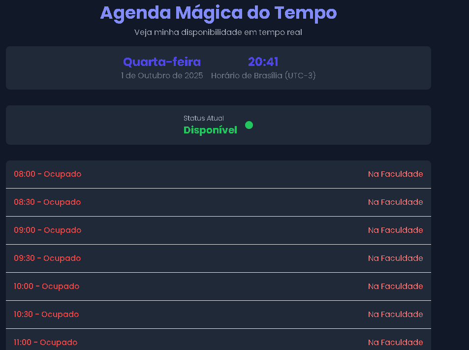

# ⏳ Agenda Mágica do Tempo  

Um site interativo para visualizar minha **disponibilidade em tempo real**.  
O projeto exibe os horários em que estou **ocupado** ou **disponível**, de forma dinâmica e organizada, com suporte a **modo escuro** 🌙.

---

## Acesse em https://firegodis.github.io/Relogio_da_disponibilidade/index.html

---

## 🚀 Funcionalidades  

- 📅 Seleção de dias da semana para visualizar a agenda.  
- 🕒 Atualização automática da data e horário em tempo real (Horário de Brasília).  
- ✅ Indicação clara de disponibilidade:
  - **Verde** → Disponível  
  - **Vermelho** → Ocupado  
  - **Azul** → Horário atual  
  

---

## 🖼️ Preview  

> Exemplo de como o site se parece em funcionamento:



---

## 🛠️ Tecnologias Utilizadas  

- [HTML5](https://developer.mozilla.org/pt-BR/docs/Web/HTML)  
- [CSS3 + TailwindCSS](https://tailwindcss.com/)  
- [JavaScript](https://developer.mozilla.org/pt-BR/docs/Web/JavaScript)  
- [Feather Icons](https://feathericons.com/)  

---

## 📂 Estrutura  

```bash
Agenda-Magica-Tempo/
│── index.html   # Página principal com toda a lógica
│── README.md    # Documentação do projeto
